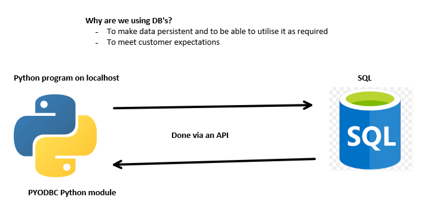

# Python with SQL using PYODBC



**Pre-requisites**
- This uses the PYODBC module. Use ```pip install pyodbc```, if not already installed into your environment.
- You may also need the ```odbc driver 17 for sql server```. This can be downloaded [here](https://docs.microsoft.com/en-us/sql/connect/odbc/download-odbc-driver-for-sql-server?view=sql-server-ver15).

**Setup**

- Set up a pyodbc connection as shown:
```python
    import pyodbc

    # Easier to declare them before passing them into the function below
    server = <server name>
    database = <database name>
    username = <username>
    password = <password>

    connection = pyodbc.connect(f"""
                                DRIVER=ODBC Driver 17 for SQL   Server;                           
                                SERVER={server};
                                DATABASE={database};
                                UID={username};
                                PWD={password}""")
```
**Querying using cursor**
- We create a cursor to allow us to query.

- The ```.execute()``` is where one queries the data. Our SQL queries should appear as the arguement for this function.
- Here, ```customers_data``` returns a list. Each value in the list represents a row inside the database.
- By default, ```.execute()``` returns all data values in the table.
```python
    cursor = connection.cursor()
    customers_data = cursor.execute("SELECT * FROM Customers")
    
    # Each list value behaves like a tuple (but the class is a pyodbc.row)
    # We can then retrieve specific columns using '.<col name>'
    for data in customers_data:
        # Prints data according the the query,
        # Since * was used, all columns are printed
        print(data)
        # Only the FirstName column in the table
        print(data.FirstName)
```

<br>

- One can also just select a single row from the table using:
```python
    # This returns the first row ONLY
    a_single_row = cursor.execute("SELECT * FROM Customers").fetchone()
    print(a_single_row)
```

---
**Summary:**
- Installation and setting up a connection
- Cursor utilisation
- ```.fetchone()``` (selects one row)
- ```.fetchall()``` (selects all rows)