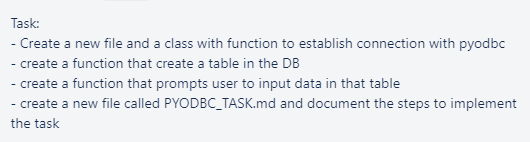

# Task



**Notes**
- This was tested on a local SQL server to avoid connection issues. In this environment, the program runs smoothly.

**Explanation**
- As always, we will need ```pyodbc``` so install it into the environment with ```pip install pyodbc``` and import it using ```import pyodbc```.

<br>

- I then create a class that will manage the entirety of this task:
```python
    class SQLInstance:
        def __init__(self, server, database, username, password):
            pass
```

<br>

- I will make a connection with the server using the class inputs. It is the first thing to be initialised when an object is created.
```python
    def __init__(self, server, database, username, password):
        self.connection = pyodbc.connect(f"""
                DRIVER=ODBC Driver 17 for SQL Server;
                SERVER={server};
                DATABASE={database};
                UID={username};
                PWD={password}""")
```

<br>

- With the connection made, I now require a cursor to use. I also make it a class attribute.
```python
    def __init__(self, server, database, username, password):
        self.connection = pyodbc.connect(f"""
                DRIVER=ODBC Driver 17 for SQL Server;
                SERVER={server};
                DATABASE={database};
                UID={username};
                PWD={password}""")
        self.cursor = self.connection.cursor()
```

<br>

- I then create a class method that will enable one to create a table within the database:
```python
    # Makes a table
    def make_table(self):
        table_name = input("\nWhat should the table be called?\n--> ")
        # Not inputting an integer will cause an error so I will catch it
        while True:
            try:
                number_of_col = int(input("\nHow many columns?\n--> "))
                break
            except:
                continue
        
        # This will be the query used to create the table
        query_string = ""
        length = len(query_string)
        
        # This will ask for the names and datatypes for the table
        for _ in range(number_of_col):
            col_name = input(f"\nInput name of column {_ + 1}: ")
            col_datatype = input(f"Input the datatype of this column: ")
            query_string = query_string + col_name + " " + col_datatype + ","

        # The query string will have an extra comma at the end, this removes it
        query_string = query_string[:length-1]

        # This will create the table and commit it
        self.cursor.execute(f"CREATE TABLE {table_name} ({query_string});")
        self.connection.commit()
```

<br>

- But now, one should be able to add additional columns if need be. I create a method to do this also:
```python
    # This adds a new column into the table
    def add_col(self):
        # Shows available tables
        self.show_possible_tables()
        table_name = input("Which table are we inserting into?\n").strip()

        # Shows the columns already in the table
        self.show_col_names(table_name)
        new_col_name = input("What is the new column name?\n")
        new_col_dt = input("What datatype will it hold? e.g. varchar(255)\n")
        query = f"ALTER TABLE {table_name} ADD {new_col_name} {new_col_dt}"

        # Double-checks if they want to add a new column
        if not self.yesno_to_query(query):
            print("Nothing done")
            return input("Press <Enter> to go back to the menu")

        try:
            self.cursor.execute(query)
            self.connection.commit()
            print("\nNew column added!")
        except:
            print("Something went wrong! Nothing has been done")
```

<br>

- Now we need a way to insert rows into our tables:
```python
    # Allows one to insert a row into a table
    # CHECKED - YES
    def insert_into(self):
        # Prints possible tables to insert rows into
        self.show_possible_tables()
        table_name = input("Which table are we inserting into?\n").strip()

        # This shows the possible columns
        self.show_col_names(table_name)
        column_names = input("Which columns are values being added to? (separate column names with commas)\n")
        
        # Asks for the values to input
        values = input("\nWhat are the values? (separate values by commas and make sure you input them as the proper datatype)\n")
        query = f"INSERT INTO {table_name} ({column_names}) VALUES ({values})"

        # Checks if they want to go through with it
        if not self.yesno_to_query(query):
            print("\nNothing done")
            return input("\nPress <Enter> to go back to the menu")

        # Many errors could occur due to the numerous numbers of possible queries
        # If one occurs, then nothing will happen
        try:
            self.cursor.execute(query)
            self.connection.commit()
            print("Row added!")
        except:
            print("\nSomething went wrong! Nothing has been done")
```

<br>

- I will also allow one to query whatever they like:
```python
    # Allows one to query a database
    # CHECKED - YES
    def query_db(self):
        self.show_possible_tables()
        # This is the query string
        query = input("\nInsert your query:\n")

        if not self.yesno_to_query(query):
            print("\nNothing done")
            return input("\nPress <Enter> to go back to the menu")
        
        # If the query causes an error, this will catch it
        try:
            result = self.cursor.execute(query)
            print("\nResults:")
            for row in result:
                print(row)
        except:
            print("\nError! \nCheck query syntax!")

        input("\nPress <Enter> to go back to the menu")
```

<br>

- Finally, I will create a menu that allows one to choose what to do:
```python
    # Menu for what to do
    def choices(self):
        while True:
            print("""\n
                        Options:
                        1. Query
                        2. Make table
                        3. Add a row to a table
                        4. Add a column to a table
                        5. Exit""")
            choice = input("---> ").strip()

            # This will deal with inputs that aren't numbers
            # I put this as the first check as trying int(choice) to a string will break the program
            if not choice.isdigit():
                print("\nNot an option!")

            elif int(choice) == 1:
                self.query_db()


            elif int(choice) == 2:
                self.make_table()
                print("\nTable created!")


            elif int(choice) == 3:
                self.insert_into()


            elif int(choice) == 4:
                self.add_col()
            
            
            elif int(choice) == 5:
                break


            else:
                print("\nNot an option!")
```

<br>

- In the end, my ```__init__``` method will look like this:
```python
    # When instantiating this class, it will connect automatically as inputted
    # It will also create a cursor to use and create a cursor
    def __init__(self, server, database, username, password):
        self.connection = pyodbc.connect(f"""
                DRIVER=ODBC Driver 17 for SQL Server;
                SERVER={server};
                DATABASE={database};
                UID={username};
                PWD={password}""")
        self.cursor = self.connection.cursor()
        self.choices()

```

<br>

- There are also other methods I have used to make the code easier to implement. These were really just created to ensure I didn't repeat code.
```python
    # This will return the possible tables
    # I made it a method as I re-used this code thus implementing DRY
    def show_possible_tables(self):
        y = self.cursor.execute("SELECT * FROM information_schema.tables")
        table_list = []
        for _ in y:
            table_list.append(_[2])
        print(f"\nThe available tables are: {table_list}")


    # This outputs all column names in the table
    # I made it a method since I used it more than once
    def show_col_names(self, table_name):
        x = self.cursor.execute(f"SELECT COLUMN_NAME FROM INFORMATION_SCHEMA.COLUMNS WHERE TABLE_NAME = '{table_name}'")
        list = []
        for _ in x:
            list.append(_[0])
        print(f"\nThese are the current columns: {list}")


    # This will return yes or no depending on if the user wants to continue with their query
    # I made it a method as I re-use this code as well
    def yesno_to_query(self, query):
        print("="*30)
        print(f"\nThe current query is:\n{query}")
        choice = input("\nWould you like to continue? (Y/N) ").strip().upper()
        
        if choice == "Y":
            return True
        elif choice == "N":
            return False
        else:
            return self.yesno_to_query(query)
```

- Finally, I will connect to the required server and database as per the task:
```python
    # Where the arguements will be the correct server, DB, user and password
    if __name__ == "__main__":
        c = SQLInstance(jserver, jdatabase, jusername, jpassword)
```