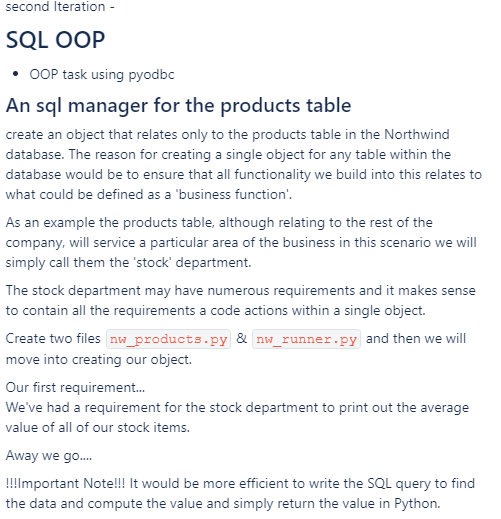

# Task



**Limitations**
- Sometimes, when the ```csv``` file is not properly encoded as utf-8 some weird characters are found, breaking the program. This was fixed using the ```ascii()``` method found in Python3 but is not at all the optimal way to solve it.